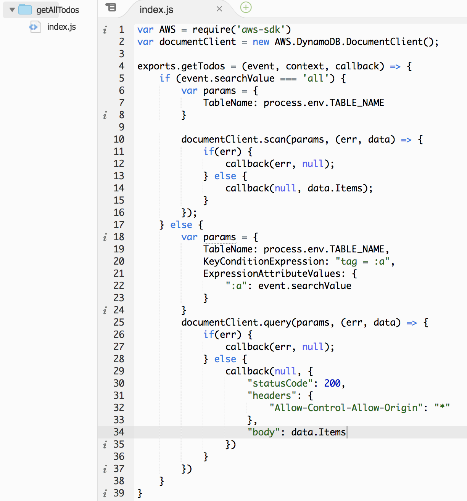
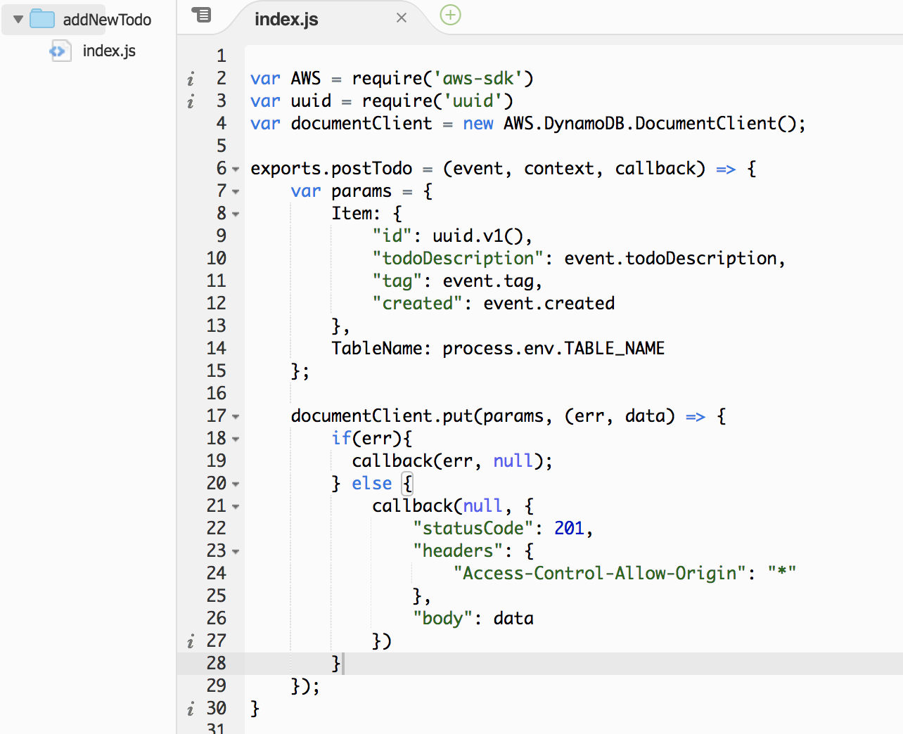

# NoteTaker


## Purpose

The objective of this code challenge was to create a simple note taking app using Node.js endpoints hosted on AWS API Gateway, while utilizing AWS Lambdas to connect to the AWS DynamoDB. I went for a stretch goal of building the front end in React which is a new technology for me.

  * Expected Functionality:
    - Allow input of new note, max of 250 characters, with dropdown menu of tags: work, personal, and hobby.
    - View all previously created notes.
    - Ability to filter items by tag and by date.
 
Visit the deployed site here: https://kathleenyruegas.github.io/note_taker/
 - Hosted on Github Pages.

### Cloning

* `git clone https://github.com/KathleenYruegas/note_taker.git` into your desired local directory
* `npm install`
* `yarn start` (app will be hosted locally on localhost:3000)


### Testing
This app is tested with `Enzyme` and `Jest`.
- To run testing:
- From root directory, `yarn test`


### Technology Used
  **Front End**
  - React
  - ES6

  **Back End**
  - AWS API Gateway
  - AWS Lambda
  - AWS DynamoDB


### API Endpoints (written on AWS API Gateway)

**GET `https://cq31v4skne.execute-api.us-east-2.amazonaws.com/beta/todos?searchValue=all`**

  - This endpoint will return all of the note items in the database.
  - Currently the `searchValue` query parameter must be set to `all`

  **Example Response**
```json
{
  "******* Headers *******"
  "Content-Type": "application/json"
}
[  "******* Body *******"
  {
      "created": "2018-12-24T20:37:24.415Z",
      "todoDescription": "Get new star map",
      "tag": "hobby",
      "id": "7c79a750-0a36-11e9-bcc2-0d0bf7a5a8bd"
  },
  {
      "created": "2018-12-28T01:05:13.702Z",
      "todoDescription": "Plan runs",
      "tag": "hobby",
      "id": "a1d97790-0a3c-11e9-a0ea-f767cfc23cfb"
  },
  {
      "created": "2018-12-28T00:21:13.826Z",
      "todoDescription": "Clean house",
      "tag": "personal",
      "id": "7c79a750-0a36-11e9-bcc2-0d0bf7a5a8bd"
  }
]
```

**POST `https://cq31v4skne.execute-api.us-east-2.amazonaws.com/beta/todos?searchValue=all`**

  - This endpoint will allow you to add a new note to the database.

  **Expected Request Format**
```json
{
  "******* Headers *******"
  "Content-Type": "application/json"
}
{
  "******* Body *******"
  "todoDescription": "New note info goes here",
  "tag": "work",
  "created": "Tues, Jan 5th"
}
```
  * Note: The `created` attribute can be in any format.

  **Example Response**

  - A successful response will return `status code: 200`


  ### Live App Usage

  


**Known Issues**

- When a filter has been selected and the user is only seeing the notes associated with that tag, and then they add a new note with that same tag, the note does not pop up until the user clicks one (any) of the filter buttons again.

- Filter by Date functionality is in progress.

- Needs more testing.

- Needs more styling.

*The lambda code in this repo was copied and pasted from my AWS Lambda Console and is for display purposes only.*


### AWS Services Used

Screenshots of the AWS Lambda code I used.


**Lambda Code**






### Other Information

This project was bootstrapped with [Create React App](https://github.com/facebook/create-react-app).
